# Krish Prajapati

### Backend Software Engineer
Java • Spring Boot • Distributed Systems • Kubernetes

 

  

  

 

[`Issue-Tracker`](https://github.com/kishnahai0806/Issue-Tracker)
&nbsp;•&nbsp;
[`Schoolem`](https://www.officialschoolem.org)
&nbsp;•&nbsp;
[`AI-Support-Platform`](https://github.com/kishnahai0806/AI-Support-Platform)
&nbsp;•&nbsp;
[`SteelWorks`](https://github.com/kishnahai0806/SteelWorks)

  

## `krish@github:~$ whoami --contact`

💼 [LinkedIn](https://www.linkedin.com/in/krish-prajapati-swe/)

