# Krish Prajapati

### Software Engineer
Java • Spring Boot • Distributed Systems • Kubernetes

 

## `krish@github:~$ git log --graph`

  

## `krish@github:~$ neofetch`

  

## `krish@github:~$ tree`

---

# Featured Projects

### 🚀 Issue Tracker
Production-grade multi-tenant Jira-style platform.

🔗 https://github.com/kishnahai0806/Issue-Tracker

---

### 🎓 Schoolem
Live social platform for verified college students.

🌐 https://www.officialschoolem.org

---

### 🤖 AI Support Platform
Event-driven Spring Boot microservices using Kafka + OpenAI.

🔗 https://github.com/kishnahai0806/AI-Support-Platform

---

### 🏭 SteelWorks
Manufacturing analytics dashboard.

🔗 https://github.com/kishnahai0806/SteelWorks

---

## Contact

📧 kprajapati0806@gmail.com

💼 LinkedIn:
https://www.linkedin.com/in/krish-prajapati-swe/
