<div align="center">

# Krish Prajapati

### Software Engineer
Java • Spring Boot • Distributed Systems • Kubernetes

<br>

## `krish@github:~$ git contributions`


<br><br>

## `krish@github:~$ whoami`

<table>
<tr>

<td valign="top" width="40%">

</td>

<td valign="top" width="60%">

</td>

</tr>
</table>

</div>

---

## `krish@github:~$ ls projects`

### 🚀 Issue Tracker
**Production-grade multi-tenant project management platform**

- Kubernetes deployment with Horizontal Pod Autoscaling (2–8 replicas)
- Spring Boot, PostgreSQL, Redis
- Deny-by-default WebSocket authorization
- Atomic JWT refresh-token rotation using Redis Lua
- Redis pub/sub across replicas
- Prometheus, Grafana & OpenTelemetry observability
- 129 automated tests with 80% coverage enforced in CI

🔗 https://github.com/kishnahai0806/Issue-Tracker

---

### 🎓 Schoolem *(Private Repository)*

**Live social platform for verified college students**

- Built with a 4-person engineering team
- Designed and developed the entire direct messaging service
- Stateless Spring Boot OAuth2 Resource Server
- Mutual-follow authorization
- Rate limiting
- Cursor pagination
- Read-state tracking
- 93 automated tests

🌐 https://www.officialschoolem.org

---

### 🤖 AI Support Platform

**Event-driven ticket triage system**

- Two asynchronous Spring Boot microservices
- Apache Kafka event streaming
- OpenAI API integration
- Railway deployment
- Prometheus & Grafana monitoring
- 74 automated tests

🔗 https://github.com/kishnahai0806/AI-Support-Platform

---

### 🏭 SteelWorks

**Manufacturing analytics dashboard**

- Python
- PostgreSQL
- Playwright E2E testing
- Sentry monitoring
- Render deployment

🔗 https://github.com/kishnahai0806/SteelWorks

---

## `krish@github:~$ cat backend.txt`

```text
Java
Spring Boot
Spring Security
Spring Batch
REST APIs
WebSockets
Hibernate/JPA
Apache Kafka
OAuth2/JWT
Microservices
```

---

## `krish@github:~$ cat infrastructure.txt`

```text
Docker
Kubernetes
AWS
Linux
PostgreSQL
Redis
Supabase
MinIO
Nginx
GitHub Actions
Liquibase
```

---

## `krish@github:~$ cat engineering.txt`

```text
Distributed Systems
Event-Driven Architecture
CI/CD
Observability
Testing

JUnit
Mockito
Testcontainers
pytest
Playwright

Prometheus
Grafana
OpenTelemetry
Jaeger
Micrometer
Sentry

Agile
Scrum
Software Development Life Cycle (SDLC)
```

---

## `krish@github:~$ contact`

📧 **Email**  
kprajapati0806@gmail.com

💼 **LinkedIn**  
https://www.linkedin.com/in/krish-prajapati-swe/

🐙 **GitHub**  
https://github.com/kishnahai0806
